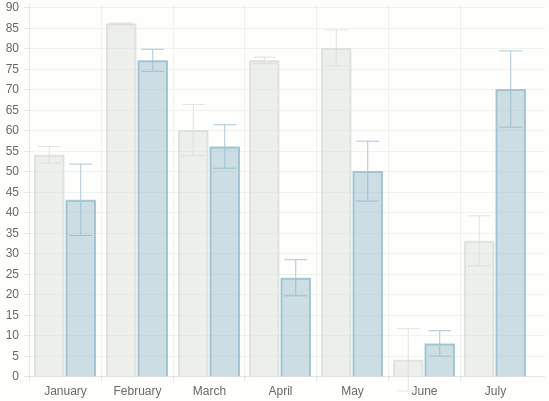
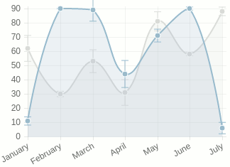

# Chart.js with Error Bars

*This is an fork of [Chart.js](http://www.chartjs.org) which supports error bars. It can be used as a stand-alone library or as an extension of the original library.

## Documentation

You can find documentation for Chart.js at [chartjs.org/docs](http://www.chartjs.org/docs/). Usage of the extension is noted below.

## Include Error Bars

Including error bars is extremely simple. Download *this* version of Chart.js and include it in your site. To add error bars, include an array called `error` (of the same length as the `data` array) in each dataset.

Options included with this version of the library:

		//String - direction of the error bars. "up", "down", or "both"
		errorDir : "both",

		//Number - stroke width of the error bars
		errorStrokeWidth : 1,

		//Number - ratio of the width of the error bar caps to the width of the bar
		errorCapWidth : 0.75,
		//For line charts, errorCapWidth is the ratio of the width of the error bar
		//caps to the radius of the points, and the default is 2.5.
		
## Compatibility

This repo is compatible with @nnnick/Chart.js, so even if you are already using Chart.js on your site, switching to my version will not harm anything.

## Chart.js 2.0

A previous version (based on the old, non-API version of Chart.js) also supported scatter plots, box plots, and trendlines. This version of the project is available in the "old" branch.

At one point I made a attempt to integrate these features into the current project, but got frustrated because the API was constantly forcing me to write repetitive code. There has been a flurry of development recently toward Chartjs 2.0 which looks like it will address this - so stay tuned.

## License

Chart.js, and this exension, are available under the [MIT license](http://opensource.org/licenses/MIT).

## Bugs & issues

When reporting bugs or issues, if you could include a link to a simple [jsbin](http://jsbin.com) or similar demonstrating the issue, that'd be really helpful.