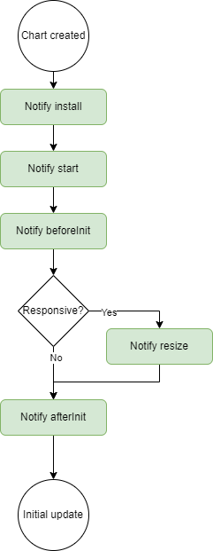
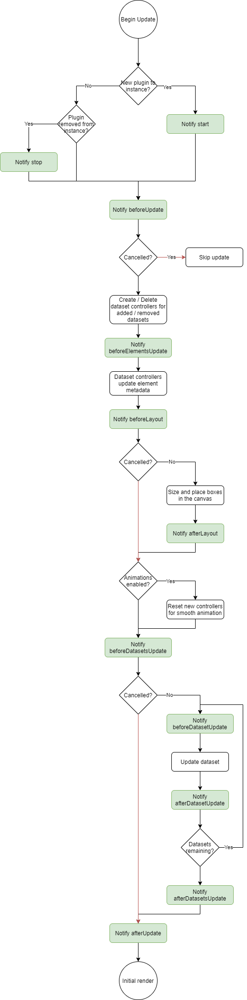
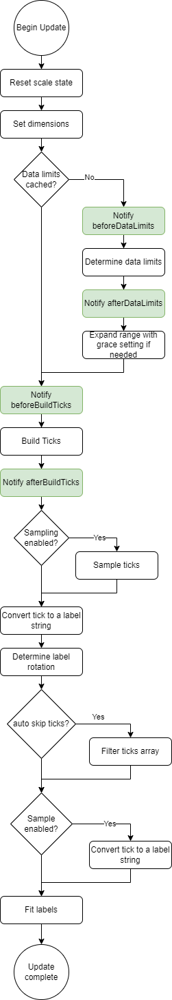
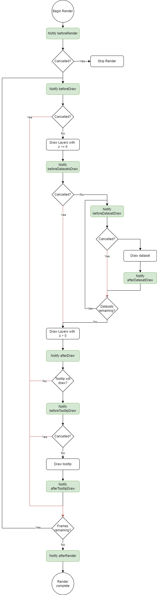
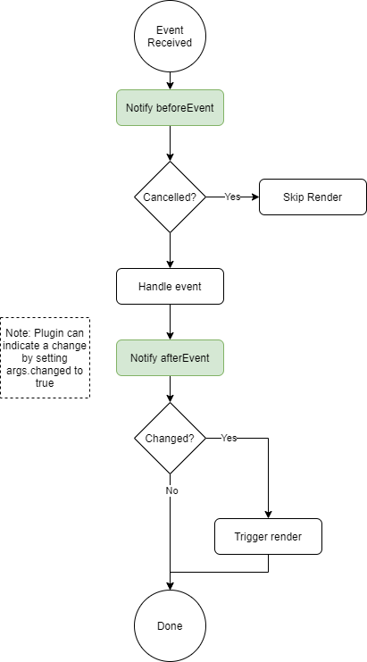
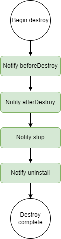

# Plugins

Plugins are the most efficient way to customize or change the default behavior of a chart. They have been introduced at [version 2.1.0](https://github.com/chartjs/Chart.js/releases/tag/2.1.0) (global plugins only) and extended at [version 2.5.0](https://github.com/chartjs/Chart.js/releases/tag/v2.5.0) (per chart plugins and options).

## Using plugins

Plugins can be shared between chart instances:

```javascript
const plugin = { /* plugin implementation */ };

// chart1 and chart2 use "plugin"
const chart1 = new Chart(ctx, {
    plugins: [plugin]
});

const chart2 = new Chart(ctx, {
    plugins: [plugin]
});

// chart3 doesn't use "plugin"
const chart3 = new Chart(ctx, {});
```

Plugins can also be defined directly in the chart `plugins` config (a.k.a. *inline plugins*):

:::warning
*inline* plugins are not registered. Some plugins require registering, i.e. can't be used *inline*.
:::

```javascript
const chart = new Chart(ctx, {
    plugins: [{
        beforeInit: function(chart, args, options) {
            //..
        }
    }]
});
```

However, this approach is not ideal when the customization needs to apply to many charts.

## Global plugins

Plugins can be registered globally to be applied on all charts (a.k.a. *global plugins*):

```javascript
Chart.register({
    // plugin implementation
});
```

:::warning
*inline* plugins can't be registered globally.
:::

## Configuration

### Plugin ID

Plugins must define a unique id in order to be configurable.

This id should follow the [npm package name convention](https://docs.npmjs.com/files/package.json#name):

- can't start with a dot or an underscore
- can't contain any non-URL-safe characters
- can't contain uppercase letters
- should be something short, but also reasonably descriptive

If a plugin is intended to be released publicly, you may want to check the [registry](https://www.npmjs.com/search?q=chartjs-plugin-) to see if there's something by that name already. Note that in this case, the package name should be prefixed by `chartjs-plugin-` to appear in Chart.js plugin registry.

### Plugin options

Plugin options are located under the `options.plugins` config and are scoped by the plugin ID: `options.plugins.{plugin-id}`.

```javascript
const chart = new Chart(ctx, {
    options: {
        foo: { ... },           // chart 'foo' option
        plugins: {
            p1: {
                foo: { ... },   // p1 plugin 'foo' option
                bar: { ... }
            },
            p2: {
                foo: { ... },   // p2 plugin 'foo' option
                bla: { ... }
            }
        }
    }
});
```

#### Disable plugins

To disable a global plugin for a specific chart instance, the plugin options must be set to `false`:

```javascript
Chart.register({
    id: 'p1',
    // ...
});

const chart = new Chart(ctx, {
    options: {
        plugins: {
            p1: false   // disable plugin 'p1' for this instance
        }
    }
});
```

To disable all plugins for a specific chart instance, set `options.plugins` to `false`:

```javascript
const chart = new Chart(ctx, {
    options: {
        plugins: false // all plugins are disabled for this instance
    }
});
```

#### Plugin defaults

You can set default values for your plugin options in the `defaults` entry of your plugin object. In the example below the canvas will always have a lightgreen backgroundColor unless the user overrides this option in `options.plugins.custom_canvas_background_color.color`.

```javascript
const plugin = {
    id: 'custom_canvas_background_color',
    beforeDraw: (chart, args, options) => {
        const {ctx} = chart;
        ctx.save();
        ctx.globalCompositeOperation = 'destination-over';
        ctx.fillStyle = options.color;
        ctx.fillRect(0, 0, chart.width, chart.height);
        ctx.restore();
    },
    defaults: {
        color: 'lightGreen'
    }
}
```

## Plugin Core API

Read more about the [existing plugin extension hooks](../api/interfaces/Plugin).

### Chart Initialization

Plugins are notified during the initialization process. These hooks can be used to set up data needed for the plugin to operate.



### Chart Update

Plugins are notified throughout the update process.



### Scale Update

Plugins are notified throughout the scale update process.



### Rendering

Plugins can interact with the chart throughout the render process. The rendering process is documented in the flowchart below. Each of the green processes is a plugin notification. The red lines indicate how cancelling part of the render process can occur when a plugin returns `false` from a hook. Not all hooks are cancelable, however, in general most `before*` hooks can be cancelled.



### Event Handling

Plugins can interact with the chart during the event handling process. The event handling flow is documented in the flowchart below. Each of the green processes is a plugin notification. If a plugin makes changes that require a re-render, the plugin can set `args.changed` to `true` to indicate that a render is needed. The built-in tooltip plugin uses this method to indicate when the tooltip has changed.



### Chart destroy

Plugins are notified during the destroy process. These hooks can be used to destroy things that the plugin made and used during its life.
The `destroy` hook has been deprecated since Chart.js version 3.7.0, use the `afterDestroy` hook instead.



## TypeScript Typings

If you want your plugin to be statically typed, you must provide a `.d.ts` TypeScript declaration file. Chart.js provides a way to augment built-in types with user-defined ones, by using the concept of "declaration merging".

When adding a plugin, `PluginOptionsByType` must contain the declarations for the plugin.

For example, to provide typings for the [`canvas backgroundColor plugin`](../configuration/canvas-background.md), you would add a `.d.ts` containing:

```ts
import {ChartType, Plugin} from 'chart.js';

declare module 'chart.js' {
  interface PluginOptionsByType<TType extends ChartType> {
    customCanvasBackgroundColor?: {
      color?: string
    }
  }
}
```
