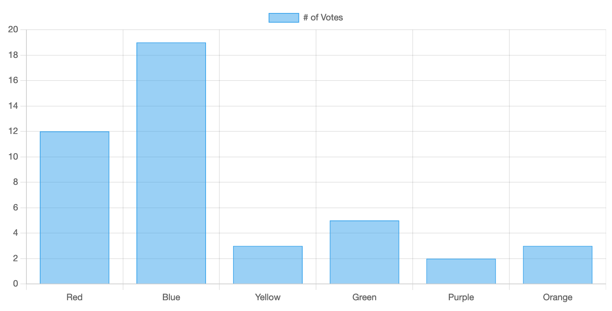

# Getting Started

Let's get started with Chart.js!

* **[Follow a step-by-step guide](./usage) to get up to speed with Chart.js**
* [Install Chart.js](./installation) from npm or a CDN 
* [Integrate Chart.js](./integration) with bundlers, loaders, and front-end frameworks

Alternatively, see the example below or check [samples](../samples).

## Create a Chart

In this example, we create a bar chart for a single dataset and render it on an HTML page. Add this code snippet to your page:

```html
<div>
  <canvas id="myChart"></canvas>
</div>

<script src="https://cdn.jsdelivr.net/npm/chart.js"></script>

<script>
  const ctx = document.getElementById('myChart');

  new Chart(ctx, {
    type: 'bar',
    data: {
      labels: ['Red', 'Blue', 'Yellow', 'Green', 'Purple', 'Orange'],
      datasets: [{
        label: '# of Votes',
        data: [12, 19, 3, 5, 2, 3],
        borderWidth: 1
      }]
    },
    options: {
      scales: {
        y: {
          beginAtZero: true
        }
      }
    }
  });
</script>
```

You should get a chart like this:



Let's break this code down.

First, we need to have a canvas in our page. It's recommended to give the chart its own container for [responsiveness](../configuration/responsive.md).

```html
<div>
  <canvas id="myChart"></canvas>
</div>
```

Now that we have a canvas, we can include Chart.js from a CDN.

```html
<script src="https://cdn.jsdelivr.net/npm/chart.js"></script>
```

Finally, we can create a chart. We add a script that acquires the `myChart` canvas element and instantiates `new Chart` with desired configuration: `bar` chart type, labels, data points, and options. 

```html
<script>
  const ctx = document.getElementById('myChart');

  new Chart(ctx, {
    type: 'bar',
    data: {
      labels: ['Red', 'Blue', 'Yellow', 'Green', 'Purple', 'Orange'],
      datasets: [{
        label: '# of Votes',
        data: [12, 19, 3, 5, 2, 3],
        borderWidth: 1
      }]
    },
    options: {
      scales: {
        y: {
          beginAtZero: true
        }
      }
    }
  });
</script>
```

You can see all the ways to use Chart.js in the [step-by-step guide](./usage).