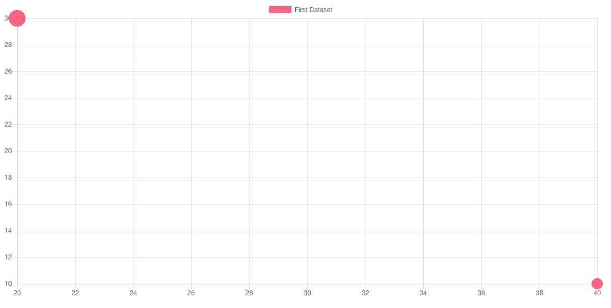

<span id="jie-shao"></span>
#### 介绍

泡泡图通常用来显示三维指标的图表，前两个值用来定位泡泡的区域，第三个值决定泡泡的大小。



<span id="shi-li"></span>
#### 实例

```javascript
// For a bubble chart
var myBubbleChart = new Chart(ctx,{
    type: 'bubble',
    data: data,
    options: options
});
```

<span id="shu-ju-ji"></span>
#### 数据集结构

| 选项名 | 类型 | 使用 |
| --- | --- | --- |
| data | Array<BubbleDataObject> | 用来绘制泡泡的数据 |
| label | String | 数据集的标签 |
| backgroundColor | Color Array<Color> | 泡泡的填充色 |
| borderColor | Color or Array<Color> | 泡泡边距颜色 |
| borderWidth | Number or Array<Number> | 泡泡边距宽度 |
| hoverBackgroundColor | Color or Array<Color>	 | 滑过时泡泡填充色 |
| hoverBorderColor | Color or Array<Color>	 | 滑过时泡泡边距颜色 |
| hoverBorderWidth | Number or Array<Number> | 滑过时泡泡边距宽度 |
| hoverRadius | Number or Array<Number> | 滑过时增加泡泡弧度 |

示例如下：

```javascript
var data = {
    datasets: [
        {
            label: 'First Dataset',
            data: [
                {
                    x: 20,
                    y: 30,
                    r: 15
                },
                {
                    x: 40,
                    y: 10,
                    r: 10
                }
            ],
            backgroundColor:"#FF6384",
            hoverBackgroundColor: "#FF6384",
        }]
};
```

<span id="shu-ju-dui-xiang"></span>
#### 数据对象

泡泡图的数据结构如下是一个对象表单，需要注意r没有被表单进行缩放，就是实际上的像素值，用来表示泡泡的大小：

```javascript
{
    // X Value
    x: <Number>,

    // Y Value
    y: <Number>,

    // Radius of bubble. This is not scaled.
    r: <Number>
}
```

<span id="tu-biao-xuan-xiang"></span>
#### 图表选项

泡泡图没有特殊的配置方法，就按照其他类型的配置方法进行配置就可以。

例如为泡泡图设置1px的黑边框，配置如下：

```javascript
new Chart(ctx,{
    type:"bubble",
    options: {
        elements: {
            points: {
                borderWidth: 1,
                borderColor: 'rgb(0, 0, 0)'
            }
        }
    }
});
```

同样我们也可以改变泡泡图的默认配置，高级用法中将会提到。